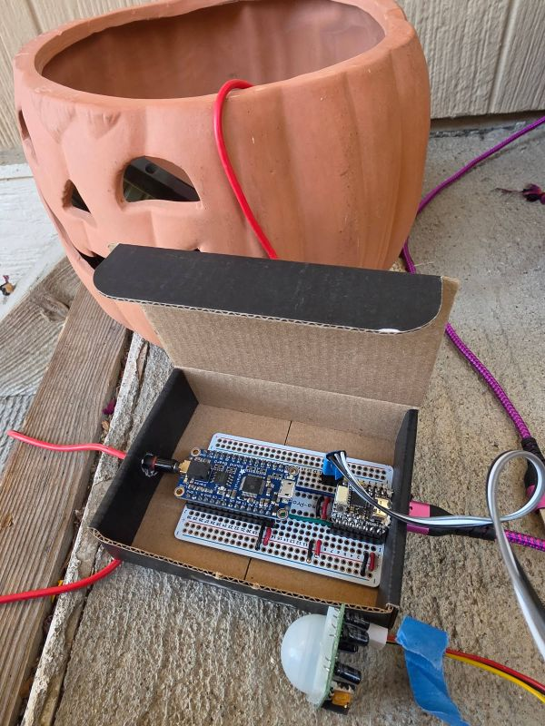
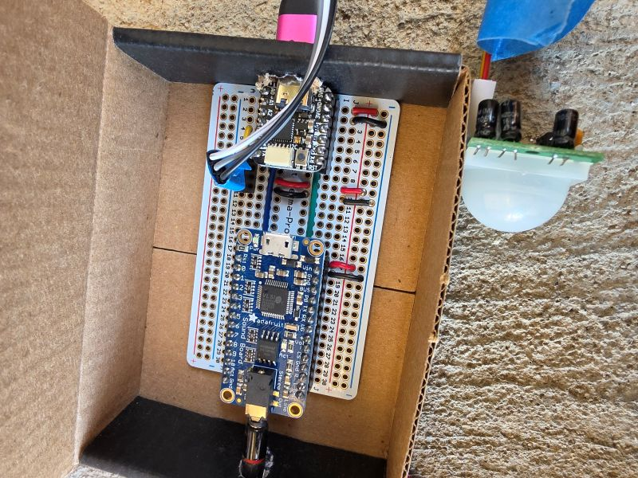

# Halloween Audio FX Sounds Motion Detector

Uses a hidden PIR sensor to detect movement then triggers fx sound board to play sound effects.

## Overview

This particular project plays spooky, creepy sounds meant to scare unsuspecting folks on Halloween as they walk by.

When motion is detected, a random sound file is played based on which PIN is triggered on an Sound FX board. The microcontroller toggles between PINs when there is a trigger event. Each trigger PIN can play up to 10 different sounds. This project uses two trigger PINs on the sound board (supports 11 triggers).

## Hardware

| Parts
| ------------------------------
| Microcontroller: [Adafruit QTPy](https://www.adafruit.com/product/4600)
| [Adafuit Audio FX Sound Board](https://www.adafruit.com/product/2220)
| PIR Sensor
| Powered speaker
| 3.5mm headphone cable
| 5V power supply
|




## Software

### Requirements

* Arduino IDE
* [QTPy Board Package](https://learn.adafruit.com/adafruit-qt-py/arduino-ide-setup)
* WAV files of halloween sound effects (the scarier, the better)

### Configuration

[Pin Definitions](https://learn.adafruit.com/assets/110643)
```cpp
const byte pirPin = 3;          // input pin (PIR sensor)
const byte fxPin0 = 7;          // connects to fx board pin 0
const byte fxPin1 = 8;          // connects to fx board pin 1
```
---

## Circuit Diagram

###
// TODO

---

## Sound Files
+ Connect FX sound board to PC using USB.
+ Copy sound files to the sound board's drive.

### Example filenames for sound effect tracks:
Name the files TnnRAND[0-9].WAV to allow an audio file play in random order when the matching trigger pin nn is connected to ground momentarily. 

PIN0:
```T00RAND0.wav, T00RAND1.wav, T00RAND2.wav, T00RAND3.wav, T00RAND4.wav, T00RAND5.wav, T00RAND6.wav, T00RAND7.wav, T00RAND8.wav, T00RAND9.wav```

PIN1:
```T01RAND0.wav, T01RAND1.wav, T01RAND2.wav, T01RAND3.wav, T01RAND4.wav, T01RAND5.wav, T01RAND6.wav, T01RAND7.wav, T01RAND8.wav, T01RAND9.wav```

See: [Copying Audio Files](https://learn.adafruit.com/adafruit-audio-fx-sound-board/copying-audio-files)

## Uploading the Software
1. Connect the QTPy board to the computer using USB.

2. Open the project in the Arduino IDE.

3. Select:

   **Tools → Board → Adafruit QT Py M0 (SAMD21)**

4. Select the appropriate serial port.

5. Compile the [sketch](./halloween_fx_sounds.ino).

6. Upload the sketch to microcontroller.

---

## Reference

[Arduino IDE](https://support.arduino.cc/hc/en-us/articles/360019833020-Download-and-install-Arduino-IDE)

[QTPy Pinouts](https://learn.adafruit.com/adafruit-qt-py?view=all#pinouts)

[FX Sound Board Pinouts](https://learn.adafruit.com/adafruit-audio-fx-sound-board/pinouts)

[Adafruit Audio FX Sound Board](https://learn.adafruit.com/adafruit-audio-fx-sound-board)